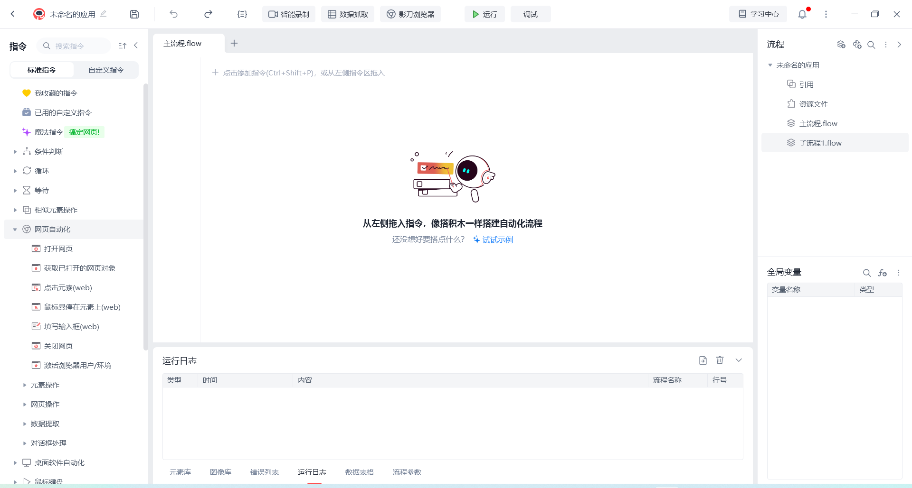

# RPA桌面自动化软件 - 影刀复刻版

## 🚀 项目简介

这是一个**完全开源**的RPA（机器人流程自动化）桌面软件，复刻了影刀RPA的核心功能。使用Python + PyQt6开发，具备可视化流程设计、网页自动化、桌面自动化等功能。



## ✨ 功能特性

- 🎨 **可视化流程设计器** - 拖拽式流程构建，直观易用
- 🌐 **网页自动化** - 支持Chrome、Firefox等主流浏览器
- 🖥️ **桌面自动化** - 桌面应用程序自动化操作
- 📊 **数据处理** - Excel、文本文件等数据操作
- 🔄 **流程控制** - 循环、条件判断等逻辑控制
- 📝 **日志监控** - 实时执行日志和错误追踪
- 🔌 **插件系统** - 可扩展的指令库

## 🛠️ 技术架构

- **GUI框架**: PyQt6
- **网页自动化**: Selenium WebDriver
- **桌面自动化**: pyautogui + pynput
- **图像识别**: OpenCV + pytesseract
- **数据库**: SQLAlchemy + SQLite
- **异步处理**: asyncio

## 📋 环境要求

- Python 3.10+
- Windows 10/11 (主要支持平台)
- 至少4GB内存
- 200MB磁盘空间

## 🚀 快速开始

### 方法1：一键安装（推荐）
```bash
# 1. 克隆项目
git clone https://github.com/linluo-bit/yingdao.git
cd yingdao

# 2. 运行安装脚本
install.bat

# 3. 启动程序
run.bat
```

### 方法2：手动安装
```powershell
# 1. 克隆项目
git clone https://github.com/linluo-bit/yingdao.git
cd yingdao

# 2. 创建虚拟环境
python -m venv venv
venv\Scripts\activate

# 3. 安装依赖
pip install -r requirements.txt

# 4. 运行程序
python main.py
```

## 📁 项目结构

```
yingdao/
├── 📄 main.py                    # 主程序入口
├── 📄 requirements.txt           # 项目依赖
├── 📄 setup.py                   # 安装配置
├── 📄 README.md                  # 说明文档
├── 📄 RPA_Architecture_Design.md # 技术架构设计
├── 📄 install.bat                # 一键安装脚本
├── 📄 run.bat                    # 一键运行脚本
├── 📄 .gitignore                 # Git忽略文件
└── 📄 影刀主页.png               # 界面参考图
```

## 🎯 开发路线

- [x] **阶段1**: 基础GUI框架 ✅
- [ ] **阶段2**: 可视化流程设计器
- [ ] **阶段3**: 网页自动化模块
- [ ] **阶段4**: 桌面自动化模块
- [ ] **阶段5**: 数据处理功能
- [ ] **阶段6**: 插件系统

## 💡 使用示例

### 基础操作流程
1. 启动软件 → 运行 `python main.py`
2. 创建项目 → 文件 → 新建项目
3. 设计流程 → 从左侧指令库拖拽指令到画布
4. 配置参数 → 双击指令节点设置参数
5. 运行调试 → 点击"运行"按钮

### 网页自动化示例
```
1. 拖入"打开网页" → 设置URL
2. 拖入"点击元素" → 设置元素选择器  
3. 拖入"填写输入框" → 设置输入内容
4. 连接各节点 → 运行流程
```

## 🔧 开发指南

### 添加新指令
1. 在对应模块中创建指令类
2. 继承`InstructionExecutor`基类
3. 实现`execute()`方法
4. 在指令库中注册

### 运行测试
```bash
pytest tests/
```

### 代码规范
```bash
# 格式化代码
black src/

# 检查代码质量
flake8 src/
```

## ❓ 常见问题

**Q: 程序启动失败？**
A: 检查Python版本是否3.10+，依赖包是否完整安装

**Q: 网页自动化不工作？**
A: 确保Chrome浏览器已安装，检查防火墙设置

**Q: 编码错误？**
A: 确保使用UTF-8编码，避免中文路径

## 🤝 贡献指南

1. Fork 项目
2. 创建功能分支 (`git checkout -b feature/AmazingFeature`)
3. 提交更改 (`git commit -m 'Add some AmazingFeature'`)
4. 推送到分支 (`git push origin feature/AmazingFeature`)
5. 打开 Pull Request

## 📄 许可证

本项目使用 MIT 许可证 - 查看 [LICENSE](LICENSE) 文件了解详情

## 🙏 致谢

- 感谢影刀RPA提供的优秀设计理念
- 感谢所有开源库的贡献者
- 感谢社区的反馈和建议

## 📧 联系方式

- 项目地址: [https://github.com/linluo-bit/yingdao](https://github.com/linluo-bit/yingdao)
- 问题反馈: [Issues](https://github.com/linluo-bit/yingdao/issues)

---

⭐ **如果这个项目对你有帮助，请给个Star支持一下！** 